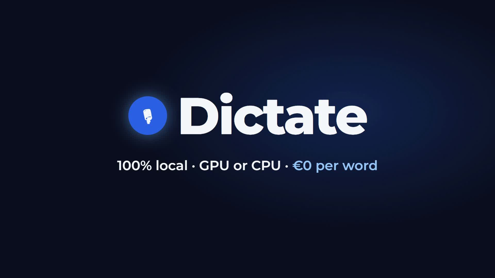

# Dictate

Press a hotkey, talk, and the text is pasted where your cursor is (terminals too). Runs **100% locally**, on **GPU or CPU**.

<video src="https://github.com/Japulgarin/dictate/raw/main/docs/demo.mp4" poster="docs/demo.jpg" controls muted width="100%"></video>

[](https://github.com/Japulgarin/dictate/raw/main/docs/demo.mp4)

▶ If the player above is empty, [open the demo video](https://github.com/Japulgarin/dictate/raw/main/docs/demo.mp4).

- Floating **bubble** shows state: 🎙 ready · ● listening · … transcribing · 📋 result (drag it, click it to open your notes)
- Default hotkey **Ctrl + Win** (toggle: press to start, press again to stop)
- Models: NVIDIA Parakeet v3 (default, best in my benchmark in `bench/results.md`), Whisper, Canary
- Languages: auto-detects Spanish / English / German

## Quick start (Windows)

```powershell
git clone https://github.com/Japulgarin/dictate
cd dictate
python -m venv .venv
.venv\Scripts\pip install -r requirements.txt
start_dictate.bat
```

You should see the bubble in the bottom-right corner and a tray icon. If not, check `dictate.log`.

## GPU or CPU

In `app/config.toml`:

```toml
device = "auto"   # auto = NVIDIA GPU if found, otherwise CPU | "cuda" | "cpu"
```

For CPU-only machines install `onnxruntime` instead of `onnxruntime-gpu`. Parakeet works well on CPU (first load ~30 s, then a few seconds per utterance); `whisper-small` is the lightest option.

## Start it with a hotkey / at login

1. Right-click `start_dictate.bat` → Send to → Desktop (create shortcut).
2. Shortcut → Properties → **Shortcut key** → press e.g. `Ctrl+Alt+D`. Pressing it again restarts the app.
3. To start at login, copy the shortcut into `shell:startup` (Win+R).

## Settings

Edit `app/config.toml` and restart: hotkey, `hotkey_mode` (`toggle`/`hold`), model, language, `auto_paste`, `silence_rms` (raise it if noise gets transcribed, lower it if it says "heard nothing").
No text appears? Check your default microphone in Windows Sound settings.

## Tech stack

| Part | Tech |
|---|---|
| Language | **Python 3.13** |
| UI (bubble, tray, notes window) | **PySide6 (Qt)** |
| Global hotkey + auto-paste | **pynput** + Windows `GetAsyncKeyState` (ctypes) |
| Microphone | **sounddevice** (PortAudio), 16 kHz mono |
| Speech-to-text | **onnx-asr / ONNX Runtime** (Parakeet, Canary) and **faster-whisper / CTranslate2** (Whisper) |
| Compute | NVIDIA **CUDA** or **CPU** (`device` in config) |
| Settings | `app/config.toml` (TOML) |
| Demo video | [HyperFrames](https://github.com/heygen-com/hyperframes) (HTML → MP4) |

## How it works

```
app/
  run.pyw      watchdog: restarts main.py if it crashes; relaunching it = restart
  main.py      Qt app: Bubble, tray icon, notes window, glues everything together
  hotkey.py    global hotkey listener (toggle or hold)
  recorder.py  always-on mic ring buffer, keeps a 0.3 s pre-roll so the first word isn't cut
  engines.py   one interface over all models: transcribe(audio) -> text, GPU/CPU choice
  config.toml  hotkey, model, language, device, auto-paste, silence threshold
bench/         benchmark scripts + results of the 7 models (results.md)
docs/          demo video
```

1. `run.pyw` starts `main.py`, which loads the model in a background thread (bubble shows "Loading model…").
2. Hotkey pressed → `recorder.py` starts keeping audio (plus the pre-roll) → bubble turns red "Listening…".
3. Hotkey pressed again (or released in `hold` mode) → audio goes to `engines.py` → bubble turns orange "Transcribing".
4. If the audio is quiet (below `silence_rms`) it is skipped. Otherwise the text goes to the clipboard, is pasted into the focused app (`Ctrl+V`, or `Ctrl+Shift+V` for terminals listed in `terminal_apps`), appended to the notes window, and shown in the green bubble.
5. Everything runs on your machine, nothing is sent anywhere.
